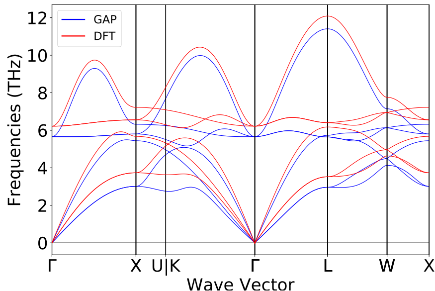
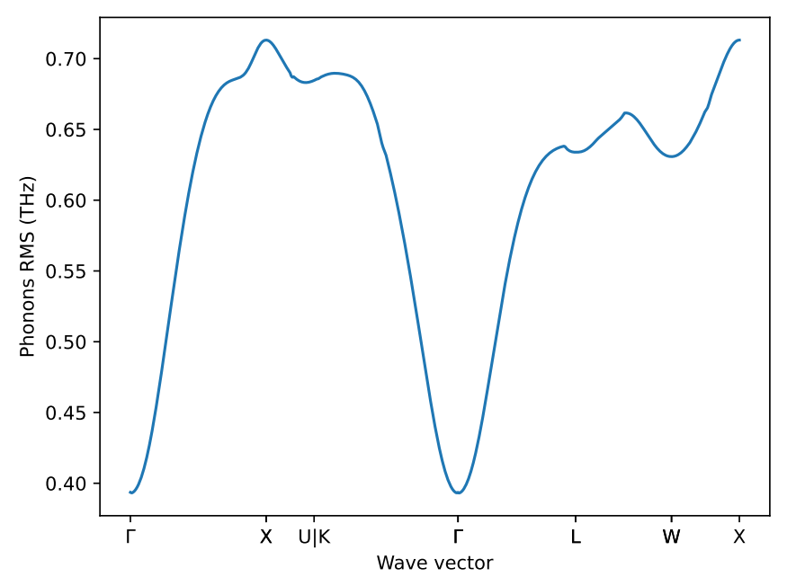

(flows)=

*Tutorials written by Christina Ertural ([christina.ertural@bam.de](mailto:christina.ertural@bam.de)).*

# Out of the box workflow

This tutorial will demonstrate how to use `autoplex` with its default setup and settings.

> ℹ️ The default setting might not be sufficient or not suitable in any other way for your calculations. Carefully check your results with the default setup and adjust the settings when needed.

## General workflow

The complete workflow of `autoplex` involves the data generation (including the execution of VASP calculations), the fitting of the  machine-learned interatomic potential (MLIP) and the benchmark to the DFT results.

Let us start by importing all the necessary modules:

```python
from jobflow.core.flow import Flow
from mp_api.client import MPRester
from autoplex.auto.phonons.flows import CompleteDFTvsMLBenchmarkWorkflow
```
We will use [jobflow](https://github.com/materialsproject/jobflow) to control the execution of our jobs in form of flows and jobs.
Using the `MPRester` is a convenient way to draw structures from the Materials Project database using their MP-ID.
The only module we need to import from `autoplex` is the `CompleteDFTvsMLBenchmarkWorkflow`.


Next, we are going to construct the workflow based on the rocksalt-type LiCl ([*mp-22905*](https://next-gen.materialsproject.org/materials/mp-22905?material_ids=mp-22905)). Don't forget to replace `YOUR_MP_API_KEY` with your personal [Materials Project API key](https://next-gen.materialsproject.org/api#api-key).

```python
mpr = MPRester(api_key='YOUR_MP_API_KEY')
structure_list = []
benchmark_structure_list = []
mpids = ["mp-22905"]  
# you can put as many mpids as needed e.g. mpids = ["mp-22905", "mp-1185319"] for all LiCl entries in the Materials Project
mpbenchmark = ["mp-22905"]
for mpid in mpids:
    structure = mpr.get_structure_by_material_id(mpid)
    structure_list.append(structure)
for mpbm in mpbenchmark:
    bm_structure = mpr.get_structure_by_material_id(mpbm)
    benchmark_structure_list.append(bm_structure)

complete_flow = CompleteDFTvsMLBenchmarkWorkflow().make(
    structure_list=structure_list, mp_ids=mpids, 
    benchmark_structures=benchmark_structure_list, benchmark_mp_ids=mpbenchmark)

autoplex_flow = Flow([complete_flow], name="tutorial", output=None, uuid=None, hosts=None)
```
The only default information we need to provide is which structures we want to calculate and use for the MLIP fitting and which structures we want to benchmark to.
The `autoplex` workflow will then perform automated VASP and `phonopy` calculations, MLIP fits, and benchmarks.
Of course, you can change and adjust the settings to your own needs, e.g. by setting a smaller supercell for the `phonopy` calculations using `CompleteDFTvsMLBenchmarkWorkflow(min_length=15).make(...)`. You can find more details on the subsequent tutorial pages.

The following workflow diagram will give you an overview of the flows and jobs in the default autoplex workflow:
```{mermaid}
flowchart TD
    f831581e-1d20-4fa8-aa7d-773ae45a78aa(external) -->|output| 25f1b412-6e80-4ea0-a669-126b1d2eefdc(data_preprocessing_for_fitting)
    f831581e-1d20-4fa8-aa7d-773ae45a78aa(external) -->|output| 75cee155-2708-4dcf-b8b3-d184d450ed4f(complete_benchmark)
    e99258a7-6717-4cc9-b629-709bee881cfa(external) -->|'dirs', 'data'| 25f1b412-6e80-4ea0-a669-126b1d2eefdc(data_preprocessing_for_fitting)
    e99258a7-6717-4cc9-b629-709bee881cfa(external) -->|'dirs', 'data'| 75cee155-2708-4dcf-b8b3-d184d450ed4f(complete_benchmark)
    38349844-bee1-4869-839f-74ccd753524e(external) -->|'dirs'| 25f1b412-6e80-4ea0-a669-126b1d2eefdc(data_preprocessing_for_fitting)
    38349844-bee1-4869-839f-74ccd753524e(external) -->|'energies', 'species'| 0a11a48c-3d9b-454a-9959-f7732967b49f(machine_learning_fit)
    38349844-bee1-4869-839f-74ccd753524e(external) -->|'dirs'| 75cee155-2708-4dcf-b8b3-d184d450ed4f(complete_benchmark)
    25f1b412-6e80-4ea0-a669-126b1d2eefdc(data_preprocessing_for_fitting) -->|output| 0a11a48c-3d9b-454a-9959-f7732967b49f(machine_learning_fit)
    0a11a48c-3d9b-454a-9959-f7732967b49f(machine_learning_fit) -->|'mlip_path'| 75cee155-2708-4dcf-b8b3-d184d450ed4f(complete_benchmark)
    75cee155-2708-4dcf-b8b3-d184d450ed4f(complete_benchmark) -->|output| d5b02fd6-806d-43f4-9f3f-d9de5f0f28e3(write_benchmark_metrics)
    subgraph 2bc86ca5-f4bd-47dc-aa9d-45f72d0ab527 [add_data]
        subgraph 821b6198-a8c5-45c5-939f-8ff0edd9f5b0 [add_data]
            f831581e-1d20-4fa8-aa7d-773ae45a78aa(dft_random_gen_data)
        end
        subgraph 75368ebe-fe58-48a9-aeba-6e81ca9169d6 [add_data]
            e99258a7-6717-4cc9-b629-709bee881cfa(dft_phonopy_gen_data)
        end
        38349844-bee1-4869-839f-74ccd753524e(get_iso_atom)
        subgraph cdcce0a3-83fe-4590-993c-0b6e3ff5adcb [MLpotentialFit]
            25f1b412-6e80-4ea0-a669-126b1d2eefdc(data_preprocessing_for_fitting)
            0a11a48c-3d9b-454a-9959-f7732967b49f(machine_learning_fit)
        end
        75cee155-2708-4dcf-b8b3-d184d450ed4f(complete_benchmark)
        d5b02fd6-806d-43f4-9f3f-d9de5f0f28e3(write_benchmark_metrics)
    end
```
The workflow starts with three flows that are supposed to generate data for our database: 
* The first flow is preparing the VASP calculation for the isolated atoms (`get_iso_atom`). 
* A second flow is preparing the `phonopy` calculations to collect the VASP data from the single-atom displaced supercells (`dft_phonopy_gen_data`). 
* The third flow is constructing randomized supercells by rattling the atoms, i.e. displacing all atoms' positions (in the default setup), preparing the VASP calculations and collecting the data for the MLIP fit (`dft_random_gen_data`).

After a few data preprocessing steps (`data_preprocessing_for_fitting`) to filter out data with too strong force values, the MLIP fit (`machine_learning_fit`) is run and the resulting potential is used for the benchmark against DFT data (`complete_benchmark`).
Finally, the result metrics are collected in form of output plots and files (`write_benchmark_metrics`). 
The lines connecting two flows or jobs are showing what type of data is passed on to the next step, like "data", "dirs" or "output". 
"Output" is a generic name for the several job outputs, e.g. the output of `dft_random_gen_data` contains where `data_preprocessing_for_fitting` can find the files it needs for the MLIP fit. 
"Data" contains the [phonon calculation task documents](https://materialsproject.github.io/atomate2/reference/atomate2.common.schemas.phonons.PhononBSDOSDoc.html#atomate2.common.schemas.phonons.PhononBSDOSDoc) and "dirs" contains the path to the directory where the jobs were executed.
"Energies" and "species" are isolated atoms' energies and a list of species used, and "mlip_path" is the path to the MLIP fit files.

The workflow diagram was automatically generated using [Mermaid](https://mermaid.live/) and the job connection data collected by `jobflow` for a simple job default setup with only one MP-ID.
You can add the following lines to your `autoplex` submission script to generate the specific Mermaid diagram for your own workflow setup:
```python
from jobflow.utils.graph import to_mermaid

...

autoplex_flow = Flow(...)

graph_source = to_mermaid(autoplex_flow, show_flow_boxes=True)
print(graph_source)  # show mermaid graph
```
Then you can paste the printed text to the [Mermaid Live Online FlowChart & Diagrams Editor](https://mermaid.live/). 

The `autoplex` workflow is easy to customize and every aspect of the workflow (data generation, MLIP fit, benchmark) is in the control of the user as demonstrated in the subsequent tutorial pages.

## Workflow management

You can manage your `autoplex` workflow using [`FireWorks`](https://materialsproject.github.io/fireworks/) or [`jobflow-remote`](https://matgenix.github.io/jobflow-remote/). 
Please follow the installation and setup instructions on the respective guide website.

Submission using `FireWorks`:
```python
from fireworks import LaunchPad
from jobflow.managers.fireworks import flow_to_workflow

...

autoplex_flow = Flow(...)

wf = flow_to_workflow(autoplex_flow)

# submit the workflow to the FireWorks launchpad
lpad = LaunchPad.auto_load()
lpad.add_wf(wf)
```

Submission using `jobflow-remote`:
```python
from jobflow_remote import submit_flow, set_run_config

...

autoplex_flow = Flow(...)

# setting different job setups in the submission script directly:
resources = {"nodes": N, "partition": "name", "time": "01:00:00", "ntasks": ntasks, "qverbatim": "#SBATCH --get-user-env",
             "mail_user": "your_email@adress", "mail_type": "ALL"}
            # put your slurm submission keywords as needed
            # you can add "qverbatim": "#SBATCH --get-user-env" in case your conda env is not activated automatically

resources_phon = {"nodes": N, "partition": "name", "time": "05:00:00", "ntasks": ntasks, "qverbatim": "#SBATCH --get-user-env",
             "mail_user": "your_email@adress", "mail_type": "ALL"}

resources_mlip = {"nodes": N, "partition": "name", "time": "02:00:00", "ntasks": ntasks, "qverbatim": "#SBATCH --get-user-env",
             "mail_user": "your_email@adress", "mail_type": "ALL"}

autoplex_flow = set_run_config(autoplex_flow, name_filter="phonon static", resources=resources_phon)

autoplex_flow = set_run_config(autoplex_flow, name_filter="machine_learning_fit", resources=resources_mlip)

# submit the workflow to jobflow-remote
print(submit_flow(autoplex_flow, worker="autoplex_worker", resources=resources, project="autoplex"))
```


## Output and results

The default `autoplex` workflow provides you with diagnostic and benchmark output plots and results. Please note that the current shown results are the autoplex unit test examples and have not been produced by the tutorial settings.

After the MLIP fit is finished, `autoplex` outputs the training and the testing error of the current potential that is fitted.

```bash
Training error of MLIP (eV/at.): 0.0049634
Testing error of MLIP (eV/at.): 0.0023569
```

"MLIP vs. DFT" plots for the energy and force values will be automatically saved which provides you with information about the quality of your fit.

The plot is divided into three sections. First, the energies and forces for the training data, and then for the test data is plotted. `autoplex` also automatically filters the data according to a certain energy threshold (eV) `energy_limit=0.005` as well as a certain force threshold (ev/Å) `force_limit=0.1` to catch outliers resulting from inconsistencies in the data.
Finally, the energy and force filtered data is plotted in the third section. This can help you to figure out if there is a problem with your data in case the MLIP fit quality does not turn out as expected.

At the end of each workflow run, `autoplex` also provides you with the benchmark plots for the phonon bandstructure comparison between the ML-based (self) and the DFT-based (other) result,  



as well as the q-point wise phonon RMSE plot.

This will give you feedback of the overall quality of the generated ML potential.

`autoplex` also prints the file `results_LiCl.txt` (here for the example of LiCl) with a summary of the essential results of your workflow setup.
```text
Potential  Structure  MPID        Displacement (Å)  RMSE (THz)  Hyperparameters (atom-wise f, n_sparse, SOAP delta)    imagmodes(pot)  imagmodes(dft)
GAP        LiCl       mp-22905    0.01              0.47608     {'f=0.1': 'default'}                                   False           False
```

